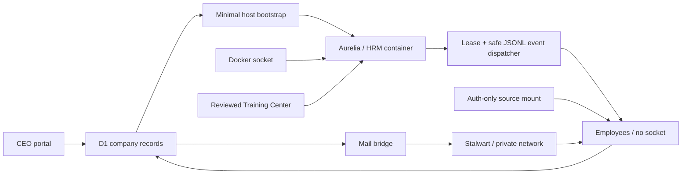

# Architecture

## Working company loop

`CEO objective -> Project Manager brief -> owned task -> HRM-provisioned Codex employee -> evidence/review -> contractor handoff -> approved company knowledge -> shipped`

The current vertical slice reaches durable project/task ownership, employee policy, real container provisioning, serialized `codex exec` dispatch, live run evidence, Secretary briefings, company mail, contractor handoff, and knowledge retention. The portal never presents placeholder output as agent work.

## Control plane and the sole socket holder

The hosted portal is the control plane. Cloudflare D1 is authoritative for employees, role snapshots, projects, tasks, handoffs, knowledge, mail intent, desired container state, and observed state. It cannot reach a workstation Docker socket directly.

The trusted host script bootstraps only Aurelia. Aurelia is created from the same Codex base as every employee, with a reviewed HRM extension that adds the Docker CLI and reconciliation program. She alone receives `/var/run/docker.sock`. Her reconciler creates and observes all other employee containers without forwarding the socket.

The bootstrap and HRM both fail closed if D1 reports any second socket holder. Runtime and run events use replay-safe keys. A requested start is never displayed as an observed running container. The loop runs one job at a time, heartbeats a two-minute lease, retries transient failures up to three times per execution cycle, and pauses immediately for owner authentication.

## Employee archetypes

| Archetype | Workspace | Resource policy | Character policy | Closeout |
|---|---|---|---|---|
| HR Manager | persistent | sole Docker provisioner | fixed Aurelia Executive | governed workforce state |
| Secretary | persistent | company-wide read-only | fixed Crimson Executive | evidence-based CEO brief |
| Project Manager | persistent | approved project/repository writes | random unreserved pet | maintained project context |
| Expert | persistent | scoped project advice | random unreserved pet | reusable company knowledge |
| Contractor | task-scoped | assigned task/repository only | fixed Solaire + Medieval name | accepted handoff required |

An employee stores the selected role ID and an employee-specific prompt snapshot. Later role edits do not silently change an existing brain. Policy fields—employment type, persistence, resource access, socket authority, character selection, and handoff requirement—remain server-enforced rather than trusting browser input.

## Base character stats and skills

`one-man-company/codex-employee:local` is the shared base image. Its profile is recorded in D1 and displayed in the Company Portal. The image contains Codex CLI, Node/npm, Git/GitHub CLI, curl, jq, ripgrep, Python, unzip, SSH, and certificates; Docker is absent.

D1 stores Training Center catalog and review state. The local filesystem stores actual skill folders. The browser accepts only a package reference or constrained `npx skills add owner/repository@skill-name` command. The trusted master downloads and inspects `SKILL.md`; only confirmed cache entries can be assigned. HRM copies only assigned folders into an employee-specific volume, and the entrypoint installs them at `/workspace/.agents/skills`.

## Credentials and external authority

`assets/agent_auth/auth.json` is excluded from Git and every image. The runtime exposes it through an auth-only source mount; the entrypoint copies it to the non-root Codex user's `.codex/auth.json` with mode `0600`.

Aurelia fingerprints the mounted source during its five-second reconciliation loop. A new fingerprint replaces only stale employee containers while retaining their named volumes, then idempotently requeues tasks and secretary inquiries whose latest run failed with the explicit authentication blocker. The fingerprint is stored in Aurelia's ignored runtime workspace; credential contents never enter D1, labels, logs, or activity records.

An optional fine-grained GitHub token is also excluded. The host importer reads the approved `VincentL01` Git Credential Manager identity without displaying it and writes only to a verified ignored path. The versioned secret source is mounted only into Project Manager containers and exported as `GH_TOKEN`. HRM also grants only those `project-write` containers outbound access inside the Codex workspace sandbox; all other employee sandboxes keep the network default disabled. A D1 project record is merely planned work. Creating a public repository under `VincentL01` is a separate executor side effect that requires an approved project and should record its resulting URL.

Each task retry records a new auditable run but points execution at the prior run's persistent workspace. Network and authentication recovery therefore resumes already validated commits instead of silently creating a fresh checkout.

The host merge watcher closes the delivery loop without giving Docker socket or host-worktree authority to an employee. It polls GitHub for a `VincentL01`-merged pull request matching the clean current `codex/*` branch. Only then may it switch the host checkout to `main`, run `git pull --ff-only origin main`, rebuild the local company, and write an idempotent `repository_syncs` record plus activity item. It refuses unexpected remotes, direct pushes, dirty worktrees, non-fast-forward main branches, and unverified merge identities.

Dorothy can read company records, mail, runtime observations, projects, and knowledge, but the API refuses to use her as a mail sender or task owner. Her prompt forbids mutations.

Secretary inquiries are durable jobs assigned only to Dorothy's running container. `company-status` retrieves the same D1 snapshot used by the CEO's employee inspector, so her answer can name the accountable employee, current task/run, heartbeat, and missing or stale evidence.

## Separate state contracts

- Task state: `queued`, `working`, `review`, `done`.
- Employee state: `offline`, `starting`, `idle`, `planning`, `working`, `waiting`, `review`, `done`, `failed`.
- Docker observation: `not_provisioned`, `created`, `running`, `paused`, `restarting`, `removing`, `exited`, `dead`, `not_found`.
- Mail state: `queued`, `sending`, `sent`, `failed`.
- Knowledge state: `candidate`, `approved`.
- Project state: `planned`, `approved`, `provisioned`, `active`, `archived`.

Character animation mappings translate employee state into sprite tracks. Character files and mappings stay separate from employee, task, and runtime state.

## Character import boundary

The onboarding desk accepts a ZIP smaller than 12 MB with root-level `pet.json` and one `spritesheet.webp` or `spritesheet.png`. It validates safe paths, manifest identity, atlas signature/dimensions, and expanded size. It never decodes, resizes, crops, or recompresses the spritesheet. Browser uploads use content-addressed R2 URLs; repository packs remain byte-for-byte static assets.

## Mail boundary

The pinned Stalwart container persists configuration and mail data in named Docker volumes on the private `one-man-company` network. Mailbox passwords stay in ignored runtime files and employee-specific read-only secret volumes. D1 records the durable outbox and delivery evidence; only the local mail bridge can change queued mail to sent after SMTP accepts it.

## Next vertical slice

1. Replace the compatibility `auth.json` copy with a managed per-employee authentication and rotation contract.
2. Let Project Managers create an approved public repository, report its URL, and dispatch repository-specific work.
3. Attach validated artifacts, commits, checks, and pull-request URLs to run evidence.
4. Archive a completed Contractor workspace only after its accepted handoff, then stop/remove the container safely.
5. Add meetings, approval gates, performance reviews/coaching, cost accounting, retrospectives, and SOP promotion as real records rather than simulated UI.
