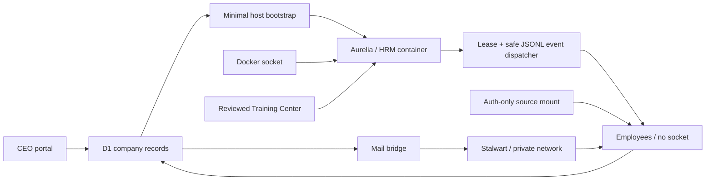

# Architecture

## Working company loop

`CEO objective -> Project Manager brief -> owned task -> HRM-provisioned Codex employee -> evidence/review -> contractor handoff -> approved company knowledge -> shipped`

The current vertical slice reaches durable project/task ownership, employee policy, real container provisioning, serialized `codex exec` dispatch, live run evidence, Secretary briefings, company mail, contractor handoff, knowledge retention, active-run portal incident filing, and a read-only Discord status adapter. The portal never presents placeholder output as agent work.

## Control plane and the sole socket holder

The hosted portal is the control plane. Cloudflare D1 is authoritative for employees, role snapshots, projects, tasks, handoffs, knowledge, mail intent, desired container state, and observed state. It cannot reach a workstation Docker socket directly.

The trusted host script bootstraps only Aurelia. Aurelia is created from the same Codex base as every employee, with a reviewed HRM extension that adds the Docker CLI and reconciliation program. She alone receives `/var/run/docker.sock`. Her reconciler creates and observes all other employee containers without forwarding the socket.

The bootstrap and HRM both fail closed if D1 reports any second socket holder. Runtime and run events use replay-safe keys. A requested start is never displayed as an observed running container. The loop runs one job at a time, heartbeats a two-minute lease, retries transient failures up to three times per execution cycle, and pauses immediately for owner authentication.

## Employee archetypes

| Archetype | Workspace | Resource policy | Character policy | Closeout |
|---|---|---|---|---|
| HR Manager | persistent | sole Docker provisioner | fixed Aurelia Executive | governed workforce state |
| Secretary | persistent | company-wide read-only | fixed Crimson Executive | evidence-based CEO brief |
| Project Manager | persistent | approved project/repository writes | random unreserved pet | maintained project context |
| Expert | persistent | scoped project advice | random unreserved pet | reusable company knowledge |
| Contractor | task-scoped | assigned task/repository only | fixed Solaire + Medieval name | accepted handoff required |

An employee stores the selected role ID and an employee-specific prompt snapshot. Later role edits do not silently change an existing brain. Policy fields—employment type, persistence, resource access, socket authority, character selection, and handoff requirement—remain server-enforced rather than trusting browser input.

## Base character stats and skills

`one-man-company/codex-employee:local` is the shared base image. Its profile is recorded in D1 and displayed in the Company Portal. The image contains Codex CLI, Node/npm, Git/GitHub CLI, curl, jq, ripgrep, Python, unzip, SSH, and certificates; Docker is absent.

D1 stores the Training Center catalog, host-observed and CEO-approved cache digests, desired employee assignments/revocations, assignment versions, folder reservations, and append-only sync observations. The local filesystem stores actual reviewed skill folders. The browser accepts only a package reference or constrained `npx skills add owner/repository@skill-name` command. Aurelia senses a mode-aware whole-tree digest; only the exact digest explicitly approved by the CEO can be assigned. Mutable cache drift immediately fails closed and requires a new approval/version.

For each non-socket employee, HRM validates the complete desired set before acting. Any missing `SKILL.md`, unsafe/reserved basename, symlinked control path, special node, folder collision, unreadable tree, mode drift, or digest mismatch fails closed and leaves the last verified set untouched. A coherent set is copied into a content-versioned candidate directory in the HRM-owned `omc-skills-*` control volume and hashed there. HRM stops the employee, then runs the base-image `sync-company-skills` program in a disposable helper with the separate `omc-installed-skills-*` active volume mounted read/write at `/workspace/.agents/skills`. The employee container mounts that active volume read-only at the same path, so it cannot self-install unapproved Codex skills; legacy unmanaged workspace bytes are preserved beneath the nested mount but are not active.

The helper stages and verifies the whole set before its swap/rollback transaction and flushes a write-ahead entry before each filesystem move. Handled command failures and signals roll back. An uncatchable container or host crash may interrupt a swap, but the next helper pass first recovers from durable manifest snapshots and a journal held in the HRM-owned control volume. It may remove only folders in the prior HRM-published managed manifest; the employee's writable `applied.json` evidence never authorizes deletion. Active-volume mutation never uses `docker exec` against a running employee.

HRM independently reads the staged control volume and the installed-skills volume after the action. The bridge-authenticated API accepts `verified` only when the approved cache, staged volume, and independent active-volume digests match and the D1 assignment version is still current. Its predecessor-ordered observations are append-only: an identical current report is a no-op, while a re-observation after a later failure becomes current. A whole-employee manifest version changes when any skill is added or removed, so Company and Secretary state exposes `employee.skills` only when every current assignment converged on one verified manifest. Desired curriculum remains separately available to HRM and the Training Room. Revocations keep their folder reservation until exact path-absence evidence atomically records history and deletes the desired row; terminal removals are not reprocessed after folder reuse. For task execution, Aurelia durably records the exact container ID and `executing`/`post-exec` phase, validates the complete result schema, and queues the terminal API action before restarting that same container identity. On dispatcher restart, an executing marker is conservatively failed, a zero-exit post-exec marker may use a valid result, and no later claim is allowed until the terminal outbox is acknowledged. If restart cannot be proven stable, Aurelia must verify the same container ID is stopped or halt.

## Credentials and external authority

`assets/agent_auth/auth.json` is excluded from Git and every image. The runtime exposes it through an auth-only source mount; the entrypoint copies it to the non-root Codex user's `.codex/auth.json` with mode `0600`.

Aurelia fingerprints the mounted source during its five-second reconciliation loop. A new fingerprint replaces only stale employee containers while retaining their named volumes, then idempotently requeues tasks and secretary inquiries whose latest run failed with the explicit authentication blocker. The fingerprint is stored in Aurelia's ignored runtime workspace; credential contents never enter D1, labels, logs, or activity records.

An optional fine-grained GitHub token is also excluded. The host importer reads the approved `VincentL01` Git Credential Manager identity without displaying it and writes only to a verified ignored path. The versioned secret source is mounted only into Project Manager containers and exported as `GH_TOKEN`. HRM also grants only those `project-write` containers outbound access inside the Codex workspace sandbox; all other employee sandboxes keep the network default disabled. A D1 project record is merely planned work. Creating a public repository under `VincentL01` is a separate executor side effect that requires an approved project and should record its resulting URL.

Each task retry records a new auditable run but points execution at the prior run's persistent workspace. Network and authentication recovery therefore resumes already validated commits instead of silently creating a fresh checkout.

The host merge watcher closes the delivery loop without giving Docker socket or host-worktree authority to an employee. It polls GitHub for a `VincentL01`-merged pull request matching the clean current `codex/*` branch. Only then may it switch the host checkout to `main`, run `git pull --ff-only origin main`, rebuild the local company, and write an idempotent `repository_syncs` record plus activity item. It refuses unexpected remotes, direct pushes, dirty worktrees, non-fast-forward main branches, and unverified merge identities.

Desired Training Center actions, company commands, mail queueing, character import, and employee onboarding/runtime requests require an independent 256-bit owner credential generated under ignored `assets/owner/runtime/credential`. It is neither derived from nor equal to the runtime bridge token. Docker receives only `OWNER_SESSION_VERIFIER`, a domain-separated SHA-256 digest that cannot be used as an accepted credential. After the verifier check succeeds and before any session write, the portal creates a random opaque token; D1 stores only its domain-separated hash, absolute expiry, and current owner-verifier version. The browser receives the opaque value in an eight-hour HttpOnly `SameSite=Strict` cookie. Every authorization performs a read-only D1 lookup for an unexpired token under the current verifier, logout deletes it, and credential rotation invalidates all prior sessions. Runtime reports and retries separately require the bridge header, which fails closed when its own secret is absent. Broad company, mail, workforce, and training-history reads accept only one of those two principals. Authorization is checked before bounded request-body parsing and before application D1/R2 writes, so an ordinary employee on the same Docker network cannot treat reachability as authority.

The raw Docker socket is deliberately treated as a trusted root control-plane boundary, equivalent to host administration. A malicious socket holder can create arbitrary bind mounts, instrument container traffic, or replace the portal, so this architecture does not claim cryptographic isolation from a hostile HR Manager. Owner sessions are a real least-privilege boundary for ordinary employee containers and normal inspectable Docker configuration; Aurelia's socket authority must remain governed as root authority.

Character ZIP uploads use expiring D1 sessions and whole-archive content-addressed R2 objects. Completion freezes the filename and size contract behind a bounded finalization lease before reading or publishing the pack; exact retries are idempotent and conflicting reuse is rejected. Each import request also performs a bounded cleanup pass for expired sessions. This is import-triggered eventual garbage collection, not a wall-clock scheduler: a future maintenance trigger should call the same bounded collector so abandoned chunks are reclaimed even when no later import occurs.

The Worker observes only uncaught first-party exceptions and API 5xx responses. It records an incident only when the request identifies an active run or exactly one active run exists. D1 normalizes and redacts local evidence, deduplicates it by a stable bug fingerprint, and exposes a leased outbox. A recurrence in a newer clean build requeues the same signature; the host watcher reopens the existing issue if necessary instead of multiplying duplicates. The watcher publishes only allowlisted category, route, status, build, run, task, and employee identifiers, reads the issue back from `VincentL01/LaAzienda`, and only then acknowledges the verified link. Diagnostic text, employee output, browser error text, request bodies, prompts, headers, and credentials never enter the public GitHub payload.

Dorothy can reason over an allowlisted view of company records, mail metadata, runtime observations, projects, and knowledge, but the API refuses to use her as a mail sender or task owner. Her prompt forbids mutations.

Secretary inquiries are durable jobs assigned only to Dorothy's running container. After the inquiry claim CAS succeeds, the executor captures a fresh, byte-bounded D1 snapshot containing only allowlisted operational fields and injects it into that single read-only claim. Mail bodies, employee prompts, access policies, and credentials are excluded. Dorothy's sandbox keeps network disabled, the legacy `company-status` command performs no portal request, and snapshot values are explicitly untrusted data rather than instructions. Her answer can still name the accountable employee, current task/run, heartbeat, and missing or stale evidence without exposing the broad control plane to employee containers.

Aurora is retained as an ordinary persistent Company Employee created from the normal Codex base image. She has task-scoped access, no socket, and no Discord-specific role or credential. `omc-discord-aurelia` is a separate non-Codex transport container presented to the CEO as Aurelia. It registers user-install `/company` and `/employee` commands, verifies the invoking user against the application owner and authorization owner, and returns bounded mention-safe status text. The adapter joins only `one-man-company-discord`, knows only `http://omc-discord-status-gateway:8080/v1/status`, and holds no portal status credential. It presents a high-entropy gateway-client capability that is mounted read-only into only the adapter and gateway. A hardened `omc-discord-status-gateway` joins both the dedicated Discord bridge and the company bridge, verifies that client capability in constant time, and is the only caller holding the unrelated portal-status token used to map exactly one authenticated bodyless `GET /v1/status` to one fixed portal status request. `Start-Company.ps1` creates both values from independent 256-bit random draws under ignored `assets/discord/runtime/`, injects the portal token into its verifier, and never derives either value from the runtime bridge secret. The status route has no runtime-bridge fallback and fails closed without that dedicated token. HRM's `runtime/state` mount cannot include the Discord-only directory, and employees receive neither token. Even if the client capability leaks, the adapter still lacks a company-network route, portal address, and portal credential. Neither container has a host port, employee workspace, Docker socket, Codex credential, GitHub credential, or HRM control action. Adapter health requires current Discord readiness plus a validated status read within 15 seconds. Replacement candidates must become healthy before promotion, interrupted stopped containers are recovered, and rollback is complete only after the previous container is renamed, restarted, and healthy. Aurelia remains the enforced HR Manager; calling her a secretary describes the CEO-facing Discord interaction, not a reassignment of the socket-holder role. Dorothy remains the modeled Secretary until the organization chart is explicitly changed.

## Separate state contracts

- Task state: `queued`, `working`, `review`, `done`.
- Employee state: `offline`, `starting`, `idle`, `planning`, `working`, `waiting`, `review`, `done`, `failed`.
- Docker observation: `not_provisioned`, `created`, `running`, `paused`, `restarting`, `removing`, `exited`, `dead`, `not_found`.
- Mail state: `queued`, `sending`, `sent`, `failed`.
- Knowledge state: `candidate`, `approved`.
- Project state: `planned`, `approved`, `provisioned`, `active`, `archived`.

Character animation mappings translate employee state into sprite tracks. Character files and mappings stay separate from employee, task, and runtime state.

## Character import boundary

The onboarding desk accepts a ZIP smaller than 12 MB with root-level `pet.json` and one `spritesheet.webp` or `spritesheet.png`. It validates safe paths, manifest identity, atlas signature/dimensions, and expanded size. It never decodes, resizes, crops, or recompresses the spritesheet. Browser uploads use content-addressed R2 URLs; repository packs remain byte-for-byte static assets.

## Mail boundary

The pinned Stalwart container persists configuration and mail data in named Docker volumes on the private `one-man-company` network. Mailbox passwords stay in ignored runtime files and employee-specific read-only secret volumes. D1 records the durable outbox and delivery evidence; only the local mail bridge can change queued mail to sent after SMTP accepts it.

## Next vertical slice

1. Replace the compatibility `auth.json` copy with a managed per-employee authentication and rotation contract.
2. Let Project Managers create an approved public repository, report its URL, and dispatch repository-specific work.
3. Attach validated artifacts, commits, checks, and pull-request URLs to run evidence.
4. Archive a completed Contractor workspace only after its accepted handoff, then stop/remove the container safely.
5. Add meetings, approval gates, performance reviews/coaching, cost accounting, retrospectives, and SOP promotion as real records rather than simulated UI.
